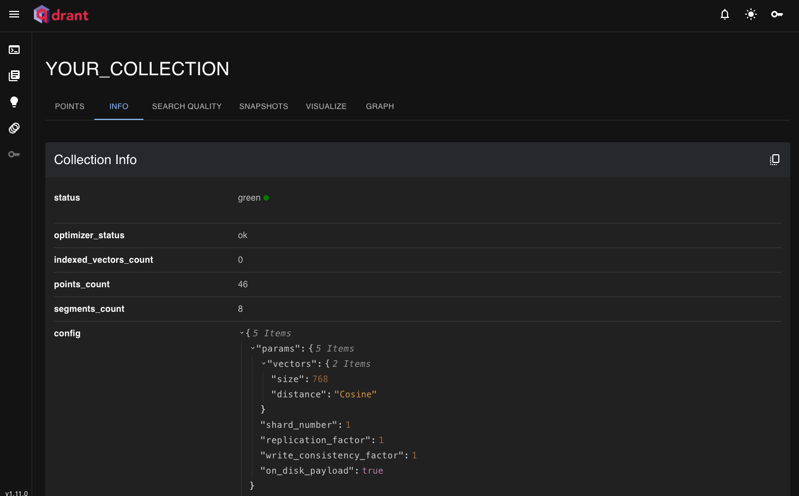
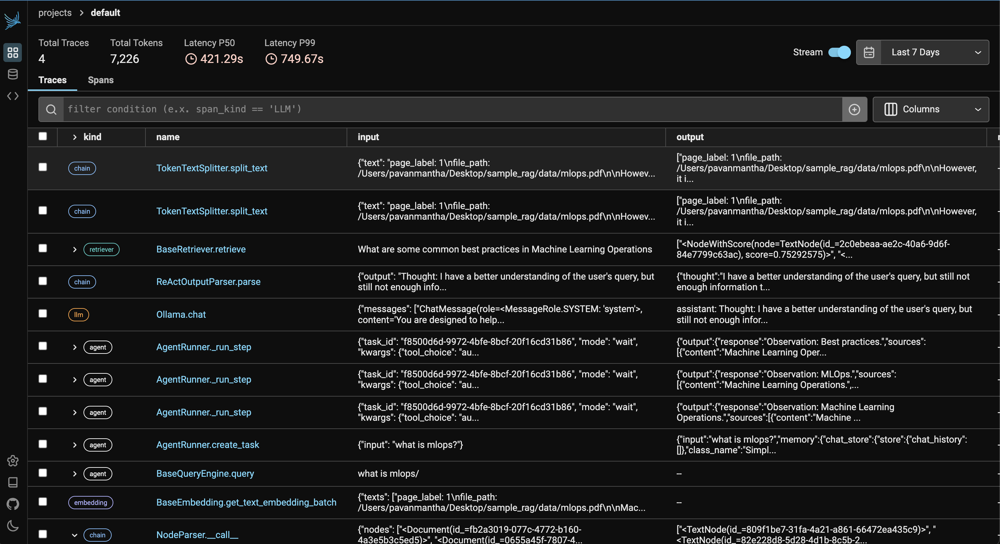

# bootstrap-rag
this project will bootstrap and scaffold the projects for specific semantic search and RAG applications along with regular boiler plate code.

### prerequisite
#### Option-1
- install ollama following this [guide](https://ollama.com/download)
- install qdrant follwing this [guide](https://qdrant.tech/documentation/guides/installation/)
#### Option-2
- In the root folder run `docker compose -f docker-compose-dev.yml up`
- One the containers are up and running run `docker exec -it ollama_service sh`
- In the container shell run `ollama run llama3.1`

### how to run the project ?
- `git clone git@github.com:pavanjava/bootstrap-rag.git`
- `pip install -e .`
- run `bootstraprag create <PROJECT_NAME>`
- Navigate to newly created project `<PROJECT_NAME>` the run `pip install -r requirements.txt`
- Once all the modules are installed run `python main.py`

### known Issues

- simple-rag project will work with no observability. with observability is under progress

Note: Only select the `llamaindex` framework or leave it empty for now, others frameworks in progress.

#### Resources

