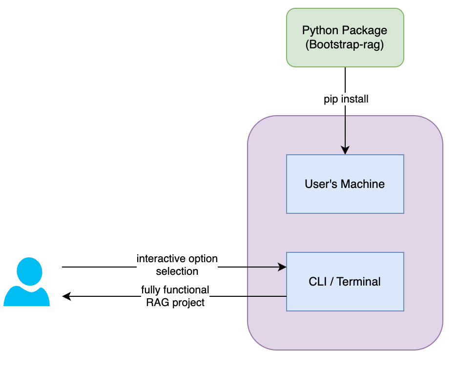

# bootstrap-rag
This project will bootstrap and scaffold the projects for specific semantic search and RAG applications along with regular boilerplate code.

### Architecture

### Installing prerequisite
#### Option-1
- install ollama following this [guide](https://ollama.com/download)
- install qdrant follwing this [guide](https://qdrant.tech/documentation/guides/installation/)
#### Option-2
- In the root folder run `docker compose -f docker-compose-dev.yml up`
- One the containers are up and running run `docker exec -it ollama_service sh`
- In the container shell run `ollama run llama3.1`

### how to run the project ?
#### Method-1
- run `pip install inquirerpy bootstrap-rag`
- run `bootstraprag create <PROJECT_NAME>`
- Navigate to newly created project `<PROJECT_NAME>` the run `pip install -r requirements.txt`
- modify the `.env` file accordingly
- run `python main.py` for cli experience
  <b>[or]</b> run `python api_server.py`

#### Method-2
- `git clone git@github.com:pavanjava/bootstrap-rag.git`
- `pip install -e .`
- run `bootstraprag create <PROJECT_NAME>`
- Navigate to newly created project `<PROJECT_NAME>` the run `pip install -r requirements.txt`
- modify the `.env` file accordingly
- run `python main.py` for cli experience
  <b>[or]</b> run `python api_server.py`

Note: Only `llamaindex` and `Qdrant Search` are functional for now, others frameworks [`langchain`, `langgraph`, `haystack`] in progress.

#### Resources

